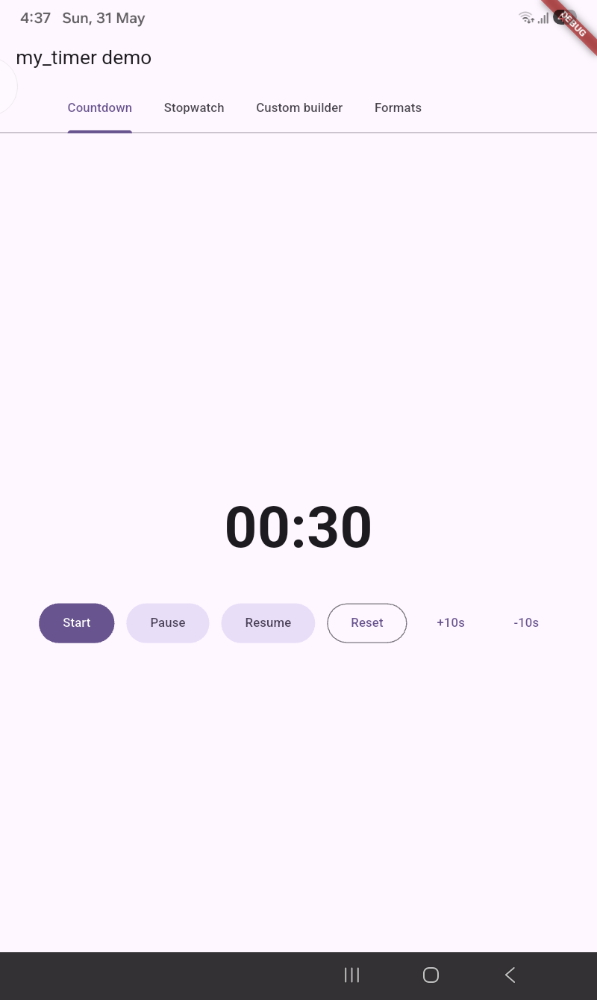
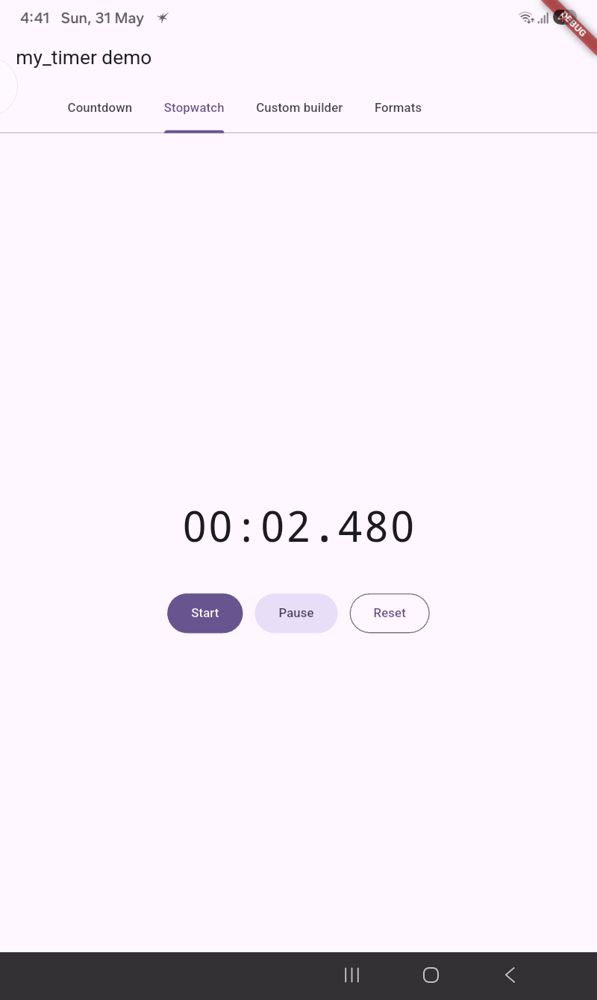
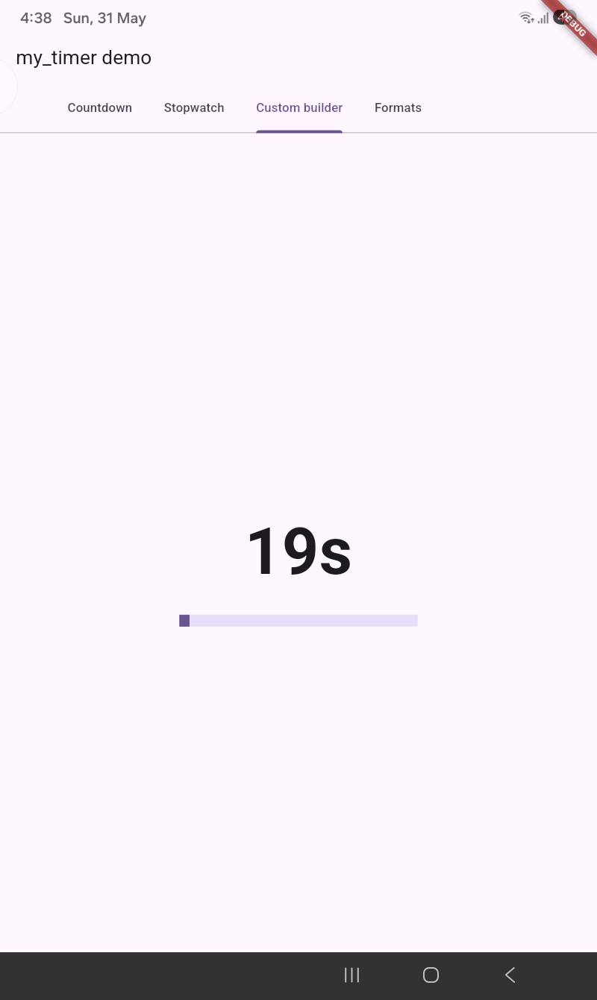
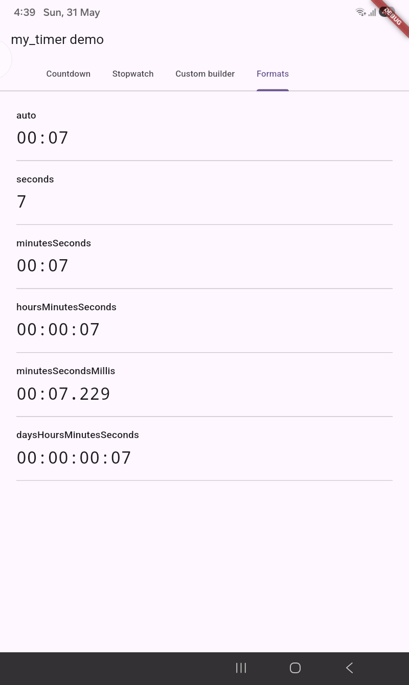

# my_timer

[](https://pub.dev/packages/my_timer)
[](https://pub.dev/packages/my_timer)
[](https://pub.dev/packages/my_timer)
[](https://pub.dev/packages/my_timer/score)
[](https://opensource.org/licenses/MIT)
[](https://pub.dev/packages/my_timer)

> A **drift-free**, **dependency-free** Flutter timer widget that handles
> count-up and count-down out of the box, with proper `pause` / `resume` /
> `reset` / `seek`, format presets, custom builders, and automatic resync
> after the app returns from the background.

<p align="center">
  
</p>

---

## Table of contents

- [Why my_timer?](#why-my_timer)
- [Screenshots](#screenshots)
- [Install](#install)
- [Quick start](#quick-start)
  - [Count-down](#count-down)
  - [Count-up](#count-up)
  - [Programmatic control](#programmatic-control)
  - [Custom rendering](#custom-rendering-with-builder)
  - [Custom formatter](#custom-formatter)
- [Format presets](#format-presets)
- [API reference](#api-reference)
- [Migrating from 1.x](#migrating-from-1x)
- [Contributing](#contributing)

---

## Why my_timer?

| | my_timer | most other packages |
|---|---|---|
| Count-up & count-down in one widget | yes | usually two separate widgets |
| `pause()` / `resume()` / `reset()` / `seek()` / `add()` / `subtract()` | yes | partial |
| Drift-free, wall-clock anchored | yes | rarely |
| Resyncs after app backgrounding | yes | rarely |
| Built-in format presets (`mm:ss`, `hh:mm:ss`, etc.) | yes | usually manual |
| Zero external dependencies | yes | many pull in `provider` / `rxdart` |
| Backwards-compatible 1.x API | yes | — |

---

## Screenshots

<table>
  <tr>
    <td align="center">
      <b>Countdown</b><br/>
      
      <br/><sub>pause · resume · reset · ±10s</sub>
    </td>
    <td align="center">
      <b>Stopwatch</b><br/>
      
      <br/><sub>count-up, millisecond precision</sub>
    </td>
  </tr>
  <tr>
    <td align="center">
      <b>Custom builder</b><br/>
      
      <br/><sub>progress bar + timer text</sub>
    </td>
    <td align="center">
      <b>Format presets</b><br/>
      
      <br/><sub>auto, mm:ss, hh:mm:ss, mm:ss.mmm, ...</sub>
    </td>
  </tr>
</table>

> Want to see it live? Run the [example app](example/lib/main.dart) — all four scenarios above are wired up as tabs.

---

## Install

```yaml
dependencies:
  my_timer: ^2.0.0
```

```bash
flutter pub add my_timer
```

---

## Quick start

### Count-down

```dart
import 'package:my_timer/my_timer.dart';

MyTimer(
  duration: const Duration(minutes: 5),
  direction: TimerDirection.countDown,
  format: TimerFormat.minutesSeconds,
  onComplete: () => debugPrint('done!'),
)
```

### Count-up

```dart
MyTimer(
  duration: const Duration(minutes: 1),
  direction: TimerDirection.countUp,
  format: TimerFormat.minutesSeconds,
)
```

### Programmatic control

```dart
final controller = MyTimerController(
  onTick: (remaining) => print('$remaining left'),
  onComplete: () => print('done!'),
);

MyTimer(
  controller: controller,
  duration: const Duration(minutes: 10),
  direction: TimerDirection.countDown,
  autoStart: false,
);

// Anywhere in your app:
controller.start();
controller.pause();
controller.resume();
controller.reset();
controller.seek(const Duration(minutes: 2));
controller.add(const Duration(seconds: 30));
controller.subtract(const Duration(seconds: 30));

// Inspect state:
controller.isRunning;
controller.isPaused;
controller.isCompleted;
controller.elapsed;
controller.remaining;
```

### Custom rendering with `builder`

```dart
MyTimer(
  duration: const Duration(minutes: 25),
  direction: TimerDirection.countDown,
  builder: (context, remaining, elapsed) {
    final total = const Duration(minutes: 25).inMilliseconds;
    return Column(
      children: [
        LinearProgressIndicator(value: elapsed.inMilliseconds / total),
        Text('${remaining.inMinutes}:${(remaining.inSeconds % 60).toString().padLeft(2, '0')}'),
      ],
    );
  },
)
```

### Custom formatter

```dart
MyTimer(
  duration: const Duration(minutes: 5),
  formatter: (d) => '${d.inSeconds} seconds left',
)
```

---

## Format presets

| `TimerFormat` | Output for `93s` | Output for `3725s` |
|---|---|---|
| `auto` | `01:33` | `01:02:05` |
| `seconds` | `93` | `3725` |
| `minutesSeconds` | `01:33` | `62:05` |
| `hoursMinutesSeconds` | `00:01:33` | `01:02:05` |
| `minutesSecondsMillis` | `01:33.000` | `62:05.000` |
| `daysHoursMinutesSeconds` | `00:00:01:33` | `00:01:02:05` |

---

## API reference

### `MyTimer`

| Parameter | Type | Default | Description |
|---|---|---|---|
| `duration` | `Duration?` | `120s` | Total duration the timer runs for. |
| `direction` | `TimerDirection` | `countUp` | `countUp` or `countDown`. |
| `tickInterval` | `Duration` | `1s` | UI refresh cadence. Doesn't affect clock accuracy. |
| `autoStart` | `bool` | `true` | Start ticking on mount. |
| `controller` | `MyTimerController?` | `null` | Remote control. |
| `builder` | `Widget Function(BuildContext, Duration remaining, Duration elapsed)?` | `null` | Custom renderer. |
| `legacyBuilder` | `Widget Function({BuildContext context, int remainingTime})?` | `null` | 1.x-style builder, for migration. |
| `child` | `Widget?` | `null` | Static replacement widget. |
| `style` | `TextStyle?` | — | Style for default text. |
| `format` | `TimerFormat` | `auto` | Built-in format preset. |
| `formatter` | `String Function(Duration)?` | `null` | Custom formatter. |
| `resyncOnResume` | `bool` | `true` | Recompute on `AppLifecycleState.resumed`. |
| `onTick` | `void Function(Duration)?` | `null` | Per-tick callback. |
| `onComplete` | `VoidCallback?` | `null` | Fires once at completion. |

### `MyTimerController`

| Method / getter | Description |
|---|---|
| `start()` / `resume()` | Start or resume. |
| `pause()` / `stop()` | Pause, preserving elapsed time. |
| `reset()` | Zero elapsed time. |
| `seek(Duration)` | Jump to a position. |
| `add(Duration)` / `subtract(Duration)` | Adjust elapsed time. |
| `isRunning` / `isPaused` / `isCompleted` / `isAttached` | State checks. |
| `elapsed` / `remaining` | Current values. |
| `getTimer()` | 1.x compatibility — returns the displayed value. |
| `onTick` / `onComplete` | Callback fields. |

---

## Migrating from 1.x

The 1.x API is preserved under deprecated names — your existing code keeps
compiling, but you should switch to the new names:

| 1.x | 2.x |
|---|---|
| `isIncrementing: true` | `direction: TimerDirection.countUp` |
| `isIncrementing: false` | `direction: TimerDirection.countDown` |
| `startTimerInSeconds` / `endTimerInSeconds` | `duration` |
| `tickInSecond` | `tickInterval` |
| `builder: ({context, remainingTime}) {...}` | `legacyBuilder: ({context, remainingTime}) {...}` |

The biggest under-the-hood improvement: the timer is now **drift-free** and
**survives app backgrounding**. Previously, `tickInSecond` of `500ms` would
cause the displayed seconds to count twice as fast as real time — that's now
fixed. See the full [CHANGELOG](CHANGELOG.md) for details.

---

## Contributing

Issues and PRs welcome at <https://github.com/Priyanshu-techind/my_timer>.

If you're capturing the screenshots referenced above, see
[`screenshots/SCREENSHOT_GUIDE.md`](screenshots/SCREENSHOT_GUIDE.md) for
exact specs.

## License

[MIT](LICENSE)
